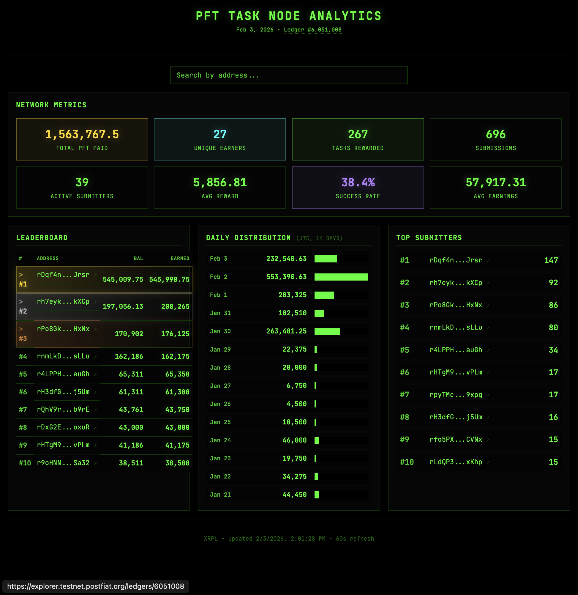

# PFT Task Node Analytics

On-chain analytics for the [Post Fiat](https://postfiat.org) network — a token economy where humans and AI agents earn PFT by completing tasks.

**[pft.w.ai →](https://pft.w.ai)**



## What This Shows

- **Network Metrics** — Total PFT distributed, unique earners, success rate
- **Leaderboard** — Top earners ranked by balance (gold/silver/bronze for top 3)
- **Daily Distribution** — 14-day bar chart of reward activity (UTC)
- **Top Submitters** — Most active task submitters
- **Wallet Search** — Look up any address to see rank and earnings

All data comes directly from the Post Fiat L1 blockchain. Updates every 60 seconds.

## Run Locally

```bash
npm install
npm run dev
```

Opens at `http://localhost:5173`. Uses production data by default.

## Testnet Reset Monitor

Use this when you expect a chain reset and want a concrete before/after impact report.

```bash
# one-time snapshot (good for sanity checks)
npm run monitor:reset:once

# continuous monitor (default 20s interval)
npm run monitor:reset
```

Optional flags:

```bash
node scripts/reset_monitor.mjs --interval 15 --out-dir ./monitor/reset-window --reset-baseline
node scripts/reset_monitor.mjs --email-to "you@example.com" --email-account wombo
```

Outputs:
- `monitor/reset-monitor/snapshots/*.json` — raw snapshots of balances and ledger index
- `monitor/reset-monitor/latest.md` — current status
- `monitor/reset-monitor/incidents/<id>/report.md` — incident impact report (trigger reasons + wallet-level deltas)
- `monitor/reset-monitor/state.json` — baseline + incident state

## How It Works

A Vercel cron job runs every minute:

1. Connects to Post Fiat RPC (`wss://ws.testnet.postfiat.org`)
2. Fetches transactions from reward wallets
3. Computes totals, leaderboard, daily activity
4. Writes JSON to Vercel Blob
5. Frontend fetches from Blob on load + 60s polling

### Key Files

| File | What It Does |
|------|--------------|
| `api/refresh-data.ts` | Serverless cron job — chain queries → Blob |
| `src/main.ts` | Dashboard rendering, search, explorer links |
| `src/style.css` | Terminal theme (black bg, #00ff00 green) |

### Tracked Addresses

**Primary reward wallets** (distribute to many users):
- `rGBKxoTcavpfEso7ASRELZAMcCMqKa8oFk`
- `rKt4peDozpRW9zdYGiTZC54DSNU3Af6pQE`
- `rJNwqDPKSkbqDPNoNxbW6C3KCS84ZaQc96`

**Relay wallets** (funded by memo addr, distribute to 1-2 users): 9 addresses tracked — see `api/refresh-data.ts`

**Memo wallet**: `rwdm72S9YVKkZjeADKU2bbUMuY4vPnSfH7` (receives pf.ptr submissions)

## Deploy Your Own

1. Fork this repo
2. Import to Vercel
3. Set `BLOB_READ_WRITE_TOKEN` (auto-configured by Vercel Blob)
4. Optional: Set `CRON_SECRET` to protect the cron endpoint
5. Optional: Set `OPENAI_API_KEY` or `PFT_OPENAI_API_KEY` to enable LLM summaries in the dev feed
6. Optional: Set `PFT_TASKNODE_JWT` to pull official Task Node leaderboard points for exact point matching

Cron runs automatically every minute.

## Agent Context

See [CLAUDE.md](CLAUDE.md) for AI agent development context.

## License

MIT

---

[Post Fiat Network](https://postfiat.org) • [Block Explorer](https://explorer.testnet.postfiat.org)
